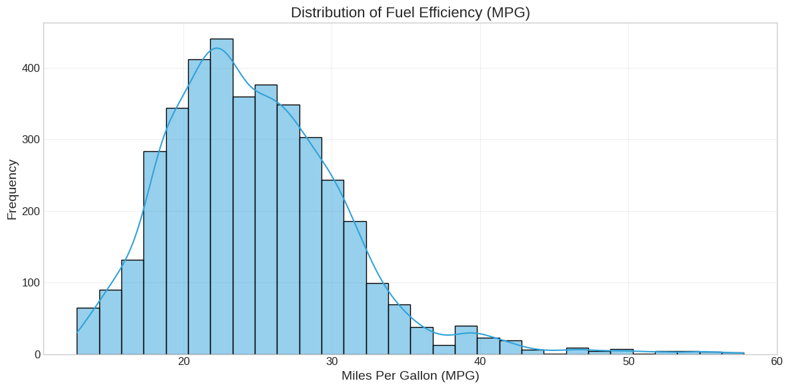
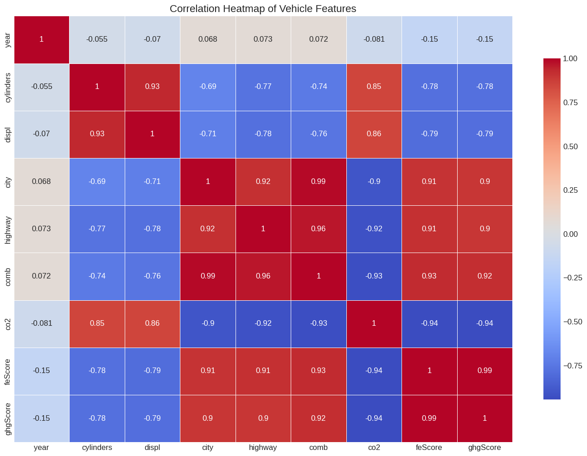

# Transport Data Analysis

Analysis of vehicle fuel efficiency data for ASC23 Transport Analysis and Global Stocktake.

## Key Findings

- Most vehicles fall in the range of 15-30 MPG, with clustering around 20-25 MPG
- Engine size (cylinders and displacement) strongly correlates with reduced fuel efficiency
- CO₂ emissions increase directly as fuel efficiency decreases
- Vehicle model year shows surprisingly little relationship with efficiency metrics

## Visualizations

### Fuel Efficiency Distribution

1. Most vehicles fall in the range of 15-30 Miles Per Gallon, showing limited consumer choice for higher efficiency options
2. The graph leans more to the left with distribution trailing off towards higher MPG values, creating a positive skew (right-skewed distribution)
3. Strong clustering around 20-25 MPG indicates the industry standard where manufacturers face highest competition
4. Gap between average MPG (21-23) and outliers (40+) MPG reveals substantial room for improvement that policy incentives should target
5. This positively skewed (right-skewed) distribution pattern suggests future technological advancements should shift the entire curve toward higher efficiency over time

### Correlation of Vehicle Features

1. City, highway, and combined MPG values are nearly identical in their relationships (0.92-0.99 correlation)
2. Larger engines (more cylinders, higher displacement) strongly reduce fuel efficiency with correlations of -0.69 to -0.78
3. CO₂ emissions increase directly as fuel efficiency decreases, shown by strong negative correlations (-0.90 to -0.93)
4. Fuel economy scores (feScore) and greenhouse gas scores (ghgScore) are essentially measuring the same thing (0.99 correlation)
5. Vehicle model year has surprisingly little relationship with any performance metrics (correlations near zero)
6. Engine characteristics (cylinders and displacement) are tightly coupled (0.93) and both strongly predict CO₂ emissions (0.85-0.8)
7. The "year" column shows minimal correlation with all other variables (correlations between -0.15 and 0.073), suggesting vehicle model year has little relationship with performance metrics and could be ignored in analysis

## Data
The dataset contained 3929 rows and 20 columns. No missing data in all colums
Some of the colums were:

* **id**, **make**, **model** - Vehicle identification
* **year** - Model year
* **VClass** - Vehicle class/category
* **drive** - Drive type
* **trans** - Transmission type
* **fuelType** - Type of fuel used
* **cylinders** - Number of engine cylinders
* **displ** - Engine displacement
* **city**, **UCity** - City fuel economy ratings
* **highway**, **UHighway** - Highway fuel economy ratings
* **comb** - Combined fuel economy
* **co2** - Carbon dioxide emissions
* **feScore**, **ghgScore** - Fuel economy and greenhouse gas scores                                              
